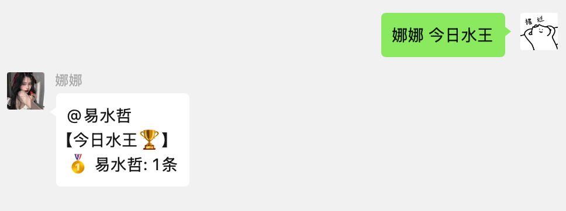
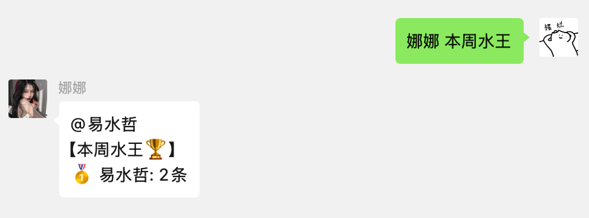
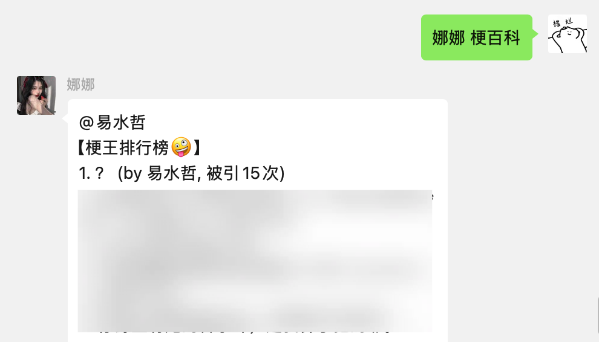
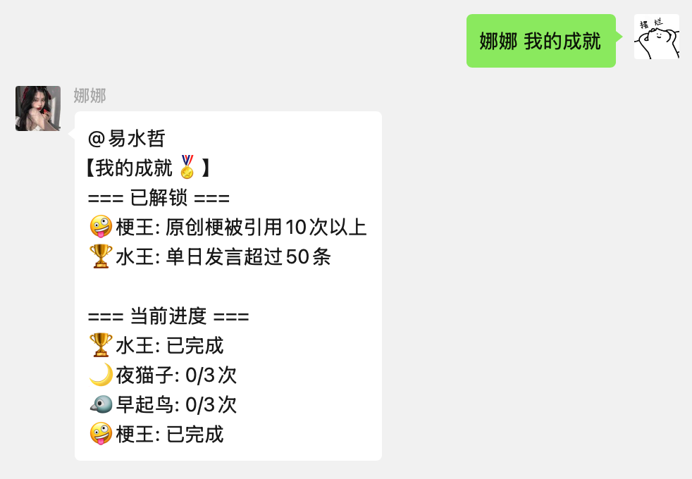

```markdown
# 微信群聊娱乐中心插件

📊 多功能微信群聊互动插件 | 🏆 水王排行 | 🤪 梗百科 | 🏅 成就系统

[](LICENSE)
[](https://www.python.org/)
[](https://sqlite.org/)

## 📌 功能概览

| 功能模块       | 命令示例       | 功能描述                          |
|----------------|----------------|---------------------------------|
| **水王排行**   | `今日水王`     | 展示当日/本周/本月最活跃成员       |
| **梗百科**     | `梗百科`       | 展示本群流行梗和表情包            |
| **成就系统**   | `我的成就`     | 查看已解锁的群聊成就              |

## 🚀 快速部署

### 前置要求
- Python 3.7+
- 微信机器人框架（如WeChatBot、ItChat等）
- SQLite 3.32+

### 安装步骤
1. 克隆项目到插件目录：
   ```bash
   git clone https://github.com/yishuizhe/dow-group-fun.git ./plugins/GroupFun
```

2. 安装依赖：
   ```bash
   缺什么依赖就安装什么依赖，应该没有
   ```

3. 重启微信机器人服务
   

## 📖 使用指南

### 基础命令
- `今日水王` - 当日发言TOP3

  

  

- `本周水王` - 本周发言排行榜

  

- `梗百科` - 查看本群TOP10流行梗

  

- `我的成就` - 已解锁成就展示

  

### 数据存储
- 位置：`plugins/GroupFunCenter/fun_center.db`
- 自动清理：保留最近30天数据


## 📜 开源协议

本项目采用 [MIT License](LICENSE)

## 💡 常见问题

Q: 数据库文件在哪里？  
A: `plugins/GroupFunCenter/fun_center.db`

Q: 如何重置所有数据？  
A: 删除数据库文件后重启插件


